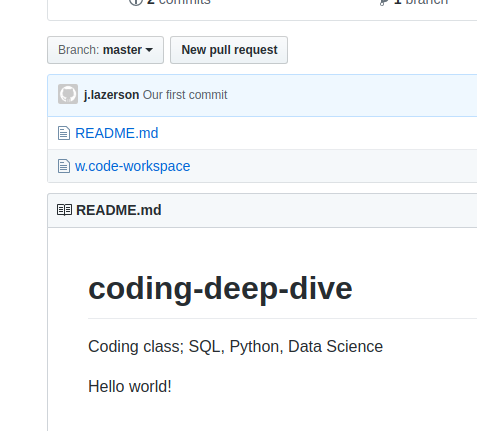

# B''H

## This is slighly smaller font size for headers

### This is even smaller font size for headers

#### This is even smaller font size for headers

This is normal text with a list:
- Mendy
- Baruch
    - car
    - truck
- Yossi

---

This numbered list:
1. house
2. car
3. mouse

---

This following words are in **bold yes** and *this* is in italics

---

Hi here is a cool `SQL` script:

```sql

select   *
from     fake-tbl
where    col = 1
order by col_2

```

Here is an image (always leave a blank line under before the image):



---

[My GitHub Repository](https://github.com/Ylazerson/coding-deep-dive)


Here is a table:

|---|---|Name  | City  | DOB|Checked|
|---|---|---|---|---|---|
|---|---| Baruch  | Long Island  |07-24-1935|Y|
|---|---|Mendy|Iowa|07-24-1925|N|


Multi-line Editing: `CTRL+SHIFT+L`


1. `jklsdf`
    - asdfasdf
2. `sdfsd`
    - sdsdfds
3. `sd`
    - sdsfsfsdfs
4. `dsfsfsf`
    - asdfsdf


