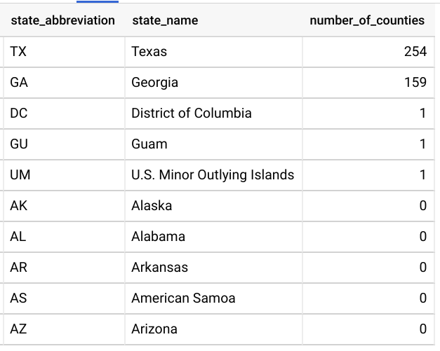

# B''H

## SQL Task 14

---

- Use the follwoing tables:
    - `data-science-course-226116.sql_lessons.join_test_counties`  
    - `data-science-course-226116.sql_lessons.join_test_states`

- Join the states to the counties and show how many counties are in each state
- Only show where the count is more than 14 or less than 2  

---

- Result should look like:

