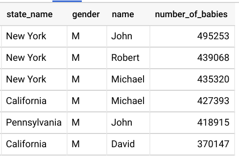

# B''H

## SQL Task 15

---

- Use the follwoing tables:
    - `bigquery-public-data.usa_names.usa_1910_current`
    - `data-science-course-226116.sql_lessons.states`

- Join the states and the names tables
- **Level-of-Grain**: state_name/gender/name
- For that **level-of-grain** get the number (sum) of the baby names
- Only show where the number of baby names is greater than 370000
- Order results by number_of_babies in descending order

---

- Result should look like:

