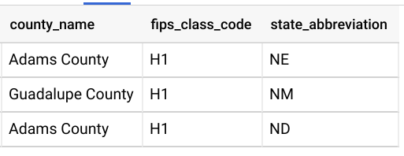

# B''H

## SQL Task 13

---

- Use the follwoing tables:
    - `data-science-course-226116.sql_lessons.join_test_counties`  
    - `data-science-course-226116.sql_lessons.join_test_states`

- Show me the counties that don't have a corresponding state in the states table
- Also, only show counties where the county name contains `'ada'`     

---

- Result should look like:

