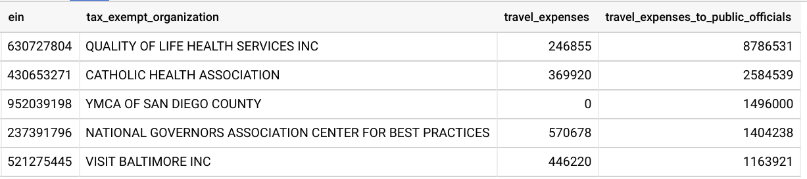

# B''H

## SQL Task 16

---

- Use the follwoing tables:
    - `bigquery-public-data.irs_990.irs_990_2017` `irs`
    - `bigquery-public-data.irs_990.irs_990_ein` `ein`

- Join the above two tables on `ein`

- Notes on column meaning:
    - `ein.name:`                Name of the tax exempt organization
    - `irs.travel:`              Money spent on travel expenses, 
    - `irs.travelofpublicoffcl:` Money spent travel expenses on public officials

- Show the top 5 spenders on travel expenses on public officials.
---

- Result should look like:

